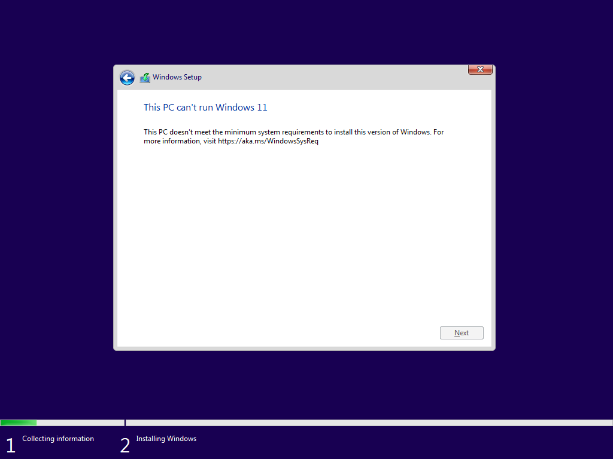
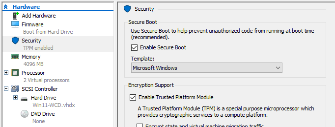

Since Windows 11 has some extra requirements, you'll need to go through some more steps when making a virtual machine in Hyper-V.

## Requirements

First you should check out the current [Windows 11 System Requirements](https://aka.ms/WindowsSysReq). As of writing the current requirements are:

- UEFI / Secure Boot Enabled (Gen 2 VM)
- TPM 2.0
- 4GB (4096MB) of Memory
- 2 vCPUs

If you don't meet these requirements, you'll be met with the following error screen and won't be able to proceed with the installation:



- These requirements can be [bypassed by using an Answer File](#bypassing-requirements).

## Create the VM

You can create a Windows 11 VM in Hyper-V either through the GUI or PowerShell.

### Option 1: Hyper-V GUI

1. Open Hyper-V Manager.
2. Click on "New" > "Virtual Machine".
3. Follow the wizard:
   - **Name**: Give your VM a name.
   - **Generation**: Select "_Generation 2_".
   - **Startup Memory**: Set to at least 4096 MB.
   - **Network**: Select a virtual switch if you have one.
   - **Virtual Hard Disk**: Create a new VHDX file (at least 64 GB).
   - **Installation Options**: Choose "_Install an operating system from a bootable image file_" and select your Windows 11 ISO.
4. Click "Finish" to create the VM.

Since the VM is Generation 2, it will automatically enable UEFI and Secure Boot. _However_ we still need to enable a virtual TPM:

1. Right-click on the newly created VM and select "_Settings_".
2. Go to "_Security_".
3. Check the box for "_Enable Trusted Platform Module_".
4. Click "_OK_" to save the settings.

Your final configuration should look similar to the below, with the TPM enabled:



You can now start the VM and proceed with the Windows 11 installation.

### Option 2: PowerShell

Hyper-V VMs can also be created using PowerShell--Hyper-V comes with a module that allows you to perform various management tasks with new and existing VMs.

- [Hyper-V Module Documentation](https://learn.microsoft.com/en-us/powershell/module/hyper-v) on Microsoft Learn

You can repurpose my script function below which will create a VM with the necessary settings for Windows 11 by default:


Download Script




## Bypassing Requirements

If you need to bypass some of the requirements, you can use the following in an [Answer File](https://learn.microsoft.com/en-us/windows-hardware/manufacture/desktop/update-windows-settings-and-scripts-create-your-own-answer-file-sxs?view=windows-11), just mount a virtual drive with the file at the root named `autounattend.xml` exactly.

The below answer file will create the necessary registry keys to bypass the TPM, Secure Boot, and RAM checks during installation:

```xml
<?xml version="1.0" encoding="utf-8"?>
<unattend xmlns="urn:schemas-microsoft-com:unattend" xmlns:wcm="http://schemas.microsoft.com/WMIConfig/2002/State">
  <settings pass="windowsPE">
    <component name="Microsoft-Windows-Setup" processorArchitecture="amd64" publicKeyToken="31bf3856ad364e35" language="neutral" versionScope="nonSxS">
      <RunSynchronous>
        <RunSynchronousCommand wcm:action="add">
          <Order>1</Order>
          <Path>reg.exe add "HKLM\SYSTEM\Setup\LabConfig" /v BypassTPMCheck /t REG_DWORD /d 1 /f</Path>
        </RunSynchronousCommand>
        <RunSynchronousCommand wcm:action="add">
          <Order>2</Order>
          <Path>reg.exe add "HKLM\SYSTEM\Setup\LabConfig" /v BypassSecureBootCheck /t REG_DWORD /d 1 /f</Path>
        </RunSynchronousCommand>
        <RunSynchronousCommand wcm:action="add">
          <Order>3</Order>
          <Path>reg.exe add "HKLM\SYSTEM\Setup\LabConfig" /v BypassRAMCheck /t REG_DWORD /d 1 /f</Path>
        </RunSynchronousCommand>
      </RunSynchronous>
    </component>
  </settings>
</unattend>
```

> Article Photo by [Sunrise King](https://unsplash.com/@sunriseking) on [Unsplash](https://unsplash.com/photos/a-macbook-air-laptop-in-a-dark-room-IN30NrknBxo)
