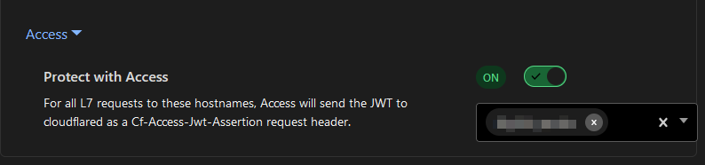

For any website services that **need to be exposed to the web**, it's far more secure ([at least in my opinion](#security-of-the-agent)) to use a [Cloudflare Tunnel] _(formerly, called [Argo](https://developers.cloudflare.com/cloudflare-one/faq/cloudflare-tunnels-faq/#why-does-the-name-warp-and-argo-appear-in-some-legacy-materials))_, instead of [opening ports](https://en.wikipedia.org/wiki/Port_forwarding) to services directly to your host or using a [VPN](https://nordvpn.com/blog/remote-access-vpn/). [Cloudflare Tunnel]s use an open-source "agent" called [cloudflared], to facilitate sending data over an [encrypted Cloudflare Tunnel](https://developers.cloudflare.com/cloudflare-one/connections/connect-networks/) to Cloudflare's servers.

The learning curve isn't horrible, and the documentation is good. If you run on-prem services that need to be accessed from the outside, I think you should at least be aware of this as an option for both personal and business use.

Cloudflare Tunnels are just [Proxy Tunnels](https://developer.mozilla.org/en-US/docs/Web/HTTP/Proxy_servers_and_tunneling), and not a direct connection to the web page, so not all apps and services may work as expected. While I've yet to come across any unsolvable problems, some things require more configuration than others to work properly over the tunnel (i.e. turning on websockets, setting headers, etc).

Cloudflare provides the [cloudflared] agent in [Docker] form, which makes it super easy to spin up and manage your agents.

> [Cloudflare Docs | How it works](https://developers.cloudflare.com/cloudflare-one/connections/connect-networks/#how-it-works)

[](https://developers.cloudflare.com/cloudflare-one/connections/connect-networks/#how-it-works)


[Cloudflare Tunnels are Free](https://blog.cloudflare.com/tunnel-for-everyone). There are [paid plans](https://www.cloudflare.com/plans/zero-trust-services/), but only enterprise will likely need it.


## Pre-configuring in One Dashboard

You'll need to setup a few things first in the Zero Trust [One Dashboard] before you can link your service to an agent and domain:

1. (Optional) [Obtain a SIGNED Certificate for Internal HTTPS](#internal-http-and-tls-no-verify).
2. Login to the [One Dashboard].
3. Create a new [firewall access group](https://developers.cloudflare.com/cloudflare-one/policies/access/) (use rules like geolocation and [SSO])
4. Add a new [Application](https://developers.cloudflare.com/cloudflare-one/applications/) and link the [firewall access group](https://developers.cloudflare.com/cloudflare-one/policies/access/).
5. Ensure all your [SSO] and [access group settings](https://developers.cloudflare.com/cloudflare-one/policies/access/) are to your liking in the [One Dashboard].

This tells Cloudflare to look for your "Application", otherwise the tunnel won't be functional once setup.

## Setting up the Tunnel

1. Add a [New Tunnel](https://developers.cloudflare.com/cloudflare-one/connections/connect-networks/get-started/create-remote-tunnel/) in the [One Dashboard].
2. Install the [cloudflared] agent on your host machine (or use the [Docker] image).
3. Activate the tunnel with the provided instructions on the tunnel settings page.


This is a "[remotely managed](https://developers.cloudflare.com/cloudflare-one/connections/connect-networks/configure-tunnels/remote-management/)" configuration of Cloudflared.


### Docker Compose Example

You can use the below compose file as a basis. Just remember to add the `TUNNEL_TOKEN` [.env variable](https://docs.docker.com/compose/environment-variables/set-environment-variables/) or add it as a [Docker Secret].

```yaml
networks:
  cf-tunnel:
services:
  tunnel:
    container_name: cloudflared-tunnel
    image: cloudflare/cloudflared:latest
    restart: always
    command: tunnel run
    environment:
      - "TUNNEL_TOKEN=${TUNNEL_TOKEN}"
    networks:
      - cf-tunnel
```

Add any services you want to expose to the `cf-tunnel` network.

## Configuring Services

Once the tunnel is up and running, you can add any services you want to expose to this tunnel. This is done by adding a new "Public Hostname" under the tunnel settings, which then will create a CNAME record in your Cloudflare DNS settings.

> If you're using Docker, you can use the `containername:port` as the url.

You'll then need to configure any additional application settings below, as a lot of services won't work out of the box. Sometimes these services provide documentation specifically for Tunnels.

If you don't want this to be publicly accessible, it's **important** to link your [Access Group][Zero Trust Access Policies] to the hostname, so only users in that group can access it and any geoblocking and/or [SSO] policies are applied.



### SSO Integrations

One of my favorite features, is the free [SSO integration](https://developers.cloudflare.com/cloudflare-one/identity/idp-integration/). It really beats whitelisting IPs and/or VPNs. For businesses this a must-have, and a game changer for home users.

I'm able to put my sites behind Google, Microsoft 365 and/or other logins. Theoretically meaning bad actors never really reach, nor know anything about my network, host or container, as Cloudflare stops them in their tracks long before they reach me. Couple this with a geoblocking policy or [device-level authentication via WARP](#sso-vs-warp-client) in [Zero Trust Access Policies] and you've got yourself quite the secure deployment (from the outside via Cloudflare at least).

For trusted IPs, I'll typically bypass SSO all together (at home, work, friends-access) for convenience sake, but everything else is behind SSO + Geoblocking.

> [What is SSO?][SSO]

## Security of the Agent

### cloudflared backdoor

While there are stories of the [cloudflared] being used as a backdoor, I'd **wager** it's far better to send/receive [encrypted] traffic via [Cloudflare Tunnel], than opening literal public-facing holes into your network (over your public IP no less) to your critical devices. This might come down to personal preference, ensure you do thorough research for your use case(s).

### Internal HTTP and 'TLS No Verify'

Cloudflare automatically establishes an [encrypted] **outbound** [connection](https://developers.cloudflare.com/cloudflare-one/connections/connect-apps/#how-it-works) with [Cloudflare's Edge](https://www.cloudflare.com/learning/serverless/glossary/what-is-edge-computing/) and your users, and from Cloudflare to your [cloudflared] tunnel agent.

However, there are a lot of cases where people use insecure `HTTP` to the tunnel internally, or use `HTTPS` with `TLS No Verify` turned on in the hostname (which means any [certificate], _even invalid ones!_ are accepted). I tend to prefer valid certs (i.e. from [LetsEncrypt](https://letsencrypt.org/) or [Cloudflare](https://www.cloudflare.com/application-services/products/ssl/)), then properly [encrypt] the connection internally to the tunnel: `https://service:1111` + `TLS No Verify` = `Off` in [One Dashboard] hostname settings. _This is more of a personal best practice I try to uphold._

If the container is using a [self-signed](https://www.entrust.com/resources/faq/what-is-a-self-signed-certificate) / automatically generated [certificate], and `TLS No Verify` is off, you'll get an error. However if you're using a valid cert but still getting a similar error, you might need to add the hostname for the expected origin [certificate] domain box for the hostname under [TLS] settings.


What is [TLS](https://www.cloudflare.com/learning/ssl/transport-layer-security-tls/) and why should I [encrypt with HTTPS/TLS internally](https://security.stackexchange.com/a/232819)?


### Isolating the Agent

For Docker, you can use a single [cloudflared] agent per [Compose Stack](https://www.portainer.io/blog/stacks-docker-compose-the-portainer-way), with a [Docker Network] defined inside. Don't attach the network to something like your database container, but attach it to the webpage serving container instead. This minimizes the network access between services, specifically where it's not needed, this _can possibly_ reduce your attack surface.

If you're not using Docker, you can still use the same concept of isolating the agent from the rest of your network -- This can be done by running the agent on a separate host or VM, and using a firewall to restrict access between the agent and your web-service(s).

### SSO vs WARP Client

[Cloudflare Tunnel]'s provide options to use [Single Sign On (SSO)](#sso-integrations) or Cloudflare's [WARP Client] for authentication into the tunneled webpage.

The [WARP Client] can be completely ignored if normal [SSO] is suitable, but if you need something such as **Device-Level Authentication**, the [WARP Client] is the way to go.

## Resources

- [Cloudflare Tunnel Documentation](https://developers.cloudflare.com/cloudflare-one/connections/connect-networks/)
- [Cloudflare Applications](https://developers.cloudflare.com/cloudflare-one/applications/)

> Article Photo by <a href="https://unsplash.com/@theshubhamdhage?utm_content=creditCopyText&utm_medium=referral&utm_source=unsplash">Shubham Dhage</a> on <a href="https://unsplash.com/photos/a-group-of-cubes-that-are-on-a-black-surface-T9rKvI3N0NM?utm_content=creditCopyText&utm_medium=referral&utm_source=unsplash">Unsplash</a>

<!--links-->

[Cloudflare Tunnel]: https://www.cloudflare.com/products/tunnel/
[One Dashboard]: https://one.dash.cloudflare.com
[WARP Client]: https://developers.cloudflare.com/cloudflare-one/connections/connect-devices/warp/
[cloudflared]: https://github.com/cloudflare/cloudflared
[SSO]: https://www.cloudflare.com/learning/access-management/what-is-sso/
[Docker Network]: https://docs.docker.com/compose/networking/
[Docker Secret]: https://docs.docker.com/compose/compose-file/09-secrets/
[Docker]: https://docker.com/
[Certificate]: https://www.cloudflare.com/learning/ssl/what-is-an-ssl-certificate/
[TLS]: https://www.cloudflare.com/learning/ssl/transport-layer-security-tls/
[Encrypted]: https://www.cloudflare.com/learning/ssl/what-is-encryption/
[Encrypt]: https://www.cloudflare.com/learning/ssl/what-is-encryption/
[Zero Trust Access Policies]: https://developers.cloudflare.com/cloudflare-one/policies/access/
