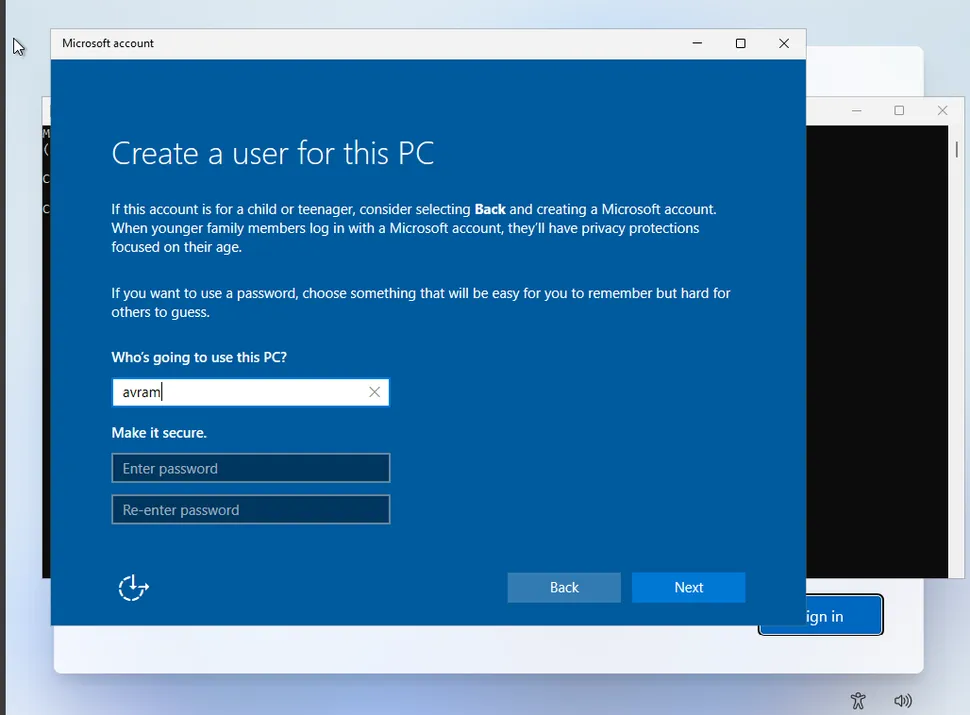

In Windows 11, you can no longer create a Local Account during OOBE setup as you could in previous editions. Microsoft seems to be actively trying to push everyone to create and use a Microsoft Account instead, which isn't feasible for IT, power-users and when you have no internet access.


As of Windows 11 24H2 (Build 26120), previous methods of bypassing this in OOBE no longer function and have been patched away by Microsoft (such as using fake creds, and `OOBE\BYPASSNRO` command).


---

During device setup ([known as OOBE](https://en.wikipedia.org/wiki/Out-of-box_experience)), press `SHIFT` + `F10` to open a command prompt.

Then run:

```powershell
ms-chx:localonly
```

A Windows 10 style window will appear to continue with creating a local account.



> Image credit: [Toms Hardware](https://www.tomshardware.com/how-to/install-windows-11-without-microsoft-account)


Note this may or may not work in later builds.


## References

- [Toms Hardware | Install Windows 11 without Microsoft Account](https://www.tomshardware.com/how-to/install-windows-11-without-microsoft-account)

> Article Photo by <a href="https://unsplash.com/@windows?utm_content=creditCopyText&utm_medium=referral&utm_source=unsplash">Windows</a> on <a href="https://unsplash.com/photos/person-using-windows-11-computer-on-lap-AigsWJmvoEo?utm_content=creditCopyText&utm_medium=referral&utm_source=unsplash">Unsplash</a>
